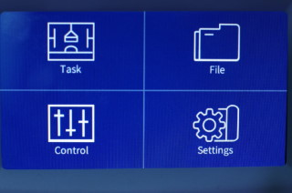
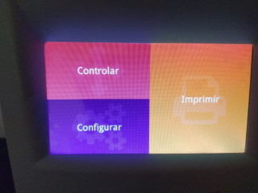

# Nova3d Elfin Lcd UI
Nova3D Elfin Lcd UI remake

From this:

To This:

The Nova3D lcd panel can be programmed using flyThings SDK.
This project is aimed to create a better looking User Interface for the machines that use this type of LCD.

The IDE can be downloaded here: https://developer.flythings.cn/zh-hans/download.html (warning slow)

The documentation is all in chinese and can be found here: https://translate.google.com/translate?hl=&sl=auto&tl=pt&u=https%3A%2F%2Fdeveloper.flythings.cn%2Fzh-hans%2F

